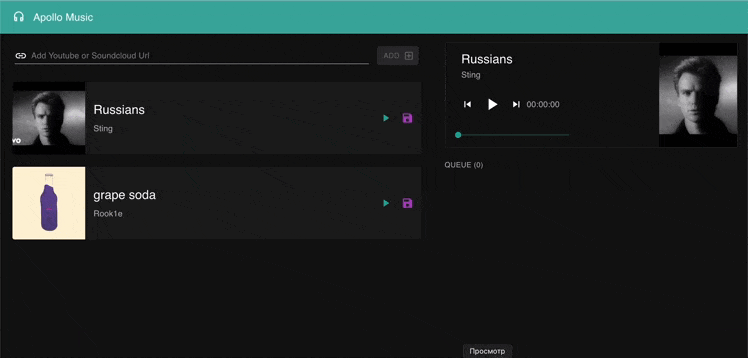

# [Apollo Music](https://chernykh-ru.github.io/apollo-music)

Add your favourite song URL from YouTube or SoundCloud, store, add to the queue, change order - everything in one place.

Don't worry if you close or refresh the app, all songs are stored in your browser local memory meaning you won't lose your playlist.

Enjoy 🎶🎵🎶🎵🎶

## Demo

## Stack:

React 18, Apollo GraphQL, WebSocket, react-player, MUI 5.

## TypeScript.

## Layout:

Figma & MUI

## Linting:

ESLint & Stylelint.
